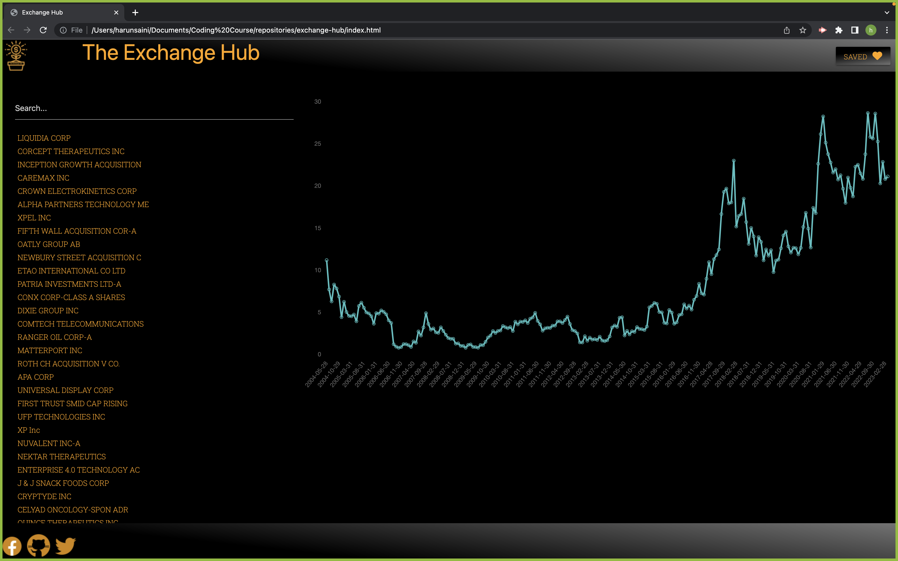

# Exchange Hub - README
Welcome to Exchange Hub, a web application that provides real-time and historical price information for a variety of financial instruments, including stocks, crypto currencies, bonds, and forex.

## Installation and viewing
### To view Exchange Hub Via link see below:

### To install Exchange Hub in VS Code or, follow these steps:

Clone or download the Exchange Hub repository to your local machine from the following link - https://github.com/darylbg/exchange-hub
Open the project in VS Code.
Open the index.html file in the project.
Right-click on the index.html file and select Open with Live Server.

## Usage
To use Exchange Hub in VS Code, follow these steps:

Browse and search for the financial instruments that interest you.
View the current and historical price data for the selected financial instrument.
save the slectec financial insturment 
Support
If you have any questions or encounter any issues while using Exhange Hub, please contact us at support@exchange-hub.com. Our team is dedicated to providing excellent customer service and will do our best to help you with any questions or concerns.

## Terms of Service
Before using Exchange Hub, please read and agree to our terms of service. By using the website, you agree to these terms and conditions.

## Privacy Policy
We take your privacy seriously at Exchange Hub. Please review our privacy policy to learn more about how we collect, use, and protect your personal information.

## Contributing
We welcome contributions from the community to help improve Exchange Hub. If you are interested in contributing, please see our contributing guidelines for more information.

## License
This project is licensed under the MIT license. Please see the LICENSE file for more information.
